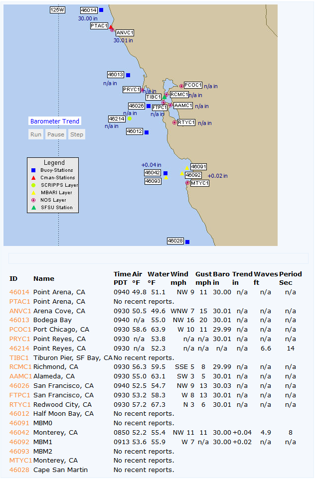

# NDBC Buoy data mesomap PHP script

This PHP script will extract recent buoy data from the National Data Buoy Center ([**https://www.ndbc.noaa.gov/**](https://www.ndbc.noaa.gov/) )and display the data as rotating conditions on a mesomap graphic and/or create a table of the current temperature, wind, barometer and wave data. Here is a live example of the output:

The script has three parts: the buoy-data.php script itself, a text configuration file, and a JPG image of the map to display. Optionally, you can use a set of wind arrows to appear in the display. Included with the distribution file are sample configuration files, wind arrows, and associated graphics from the NDBC website. Be aware that some customization of the configuration file is REQUIRED, and you'll need to be familiar with using image hotspot coordinates to do the customization. More information on customization instructions and possibilities is contained in the [**buoy-data-readme.txt**](buoy-data-readme.txt) file in the distribution.

The script output is XHTML 1.0-Strict compliant (with version 1.05). The script also creates a CSS and a JavaScript required for the rotating conditions display. This script has been tested and works with IE V6-SP2, IE7, Firefox 1.0.5.4/2.0, Netscape 7.0 and Opera 8 browsers, and a PHP 4.2.1+ with GD 2.0 enabled. If the browser's JavaScript is not enabled, a small message will appear in the output, and the mesomap will display Air Temperature only. The following parameters are available on the buoy-data.php script:

<dl>

<dt>**units=E**</dt>

<dd>(Default) Display temperature, wind, barometer and wave info in English units.</dd>

<dt>**units=M**</dt>

<dd>Display temperature, wind barometer and wave info in Metric units. .</dd>

<dt>**cnv=Y**</dt>

<dd>(default)-- convert wind speed m/s->kph and kts->mph</dd>

<dt>**cnv=N**</dt>

<dd>leave wind speed in m/s and kts</dd>

<dt>**kts=N**  (New in V1.10)</dt>

<dd>(default)-- leave wind speeds in units as set by units=M/E and cnv=Y/N</dd>

<dt>**kts=Y**  (New in V1.10)</dt>

<dd>force wind speed display to Knots</dd>

</dl>

For webmaster help with debugging the setup/configuration of the script, the following parameters may also be used:

<dl>

<dt>**show=normal**</dt>

<dd>(default) display normal mesomap graphic.</dd>

<dt>**show=hotspots**</dt>

<dd>display mesomap graphic with hotspots outlined in green to enable debugging of configuration file. Rest of page is displayed normally with rotating conditions and table of data..</dd>

<dt>**show=map**</dt>

<dd>display only the mesomap graphic image with hotspots outlined in green.</dd>

<dt>**cfg=list**</dt>

<dd>Include results of parsing the configuration file as HTML comments in the page. Useful to ensure the settings are correct in the configuration file.</dd>

<dt>**cache=no**   (_added in V1.01_)</dt>

<dd>Changes $refetchSeconds to 10 (to clear the cache file) .</dd>

</dl>

Added in V1.12 was the ability to directly include the script and print the CSS, Map and Table in a simple manner. This method is recommended for PHP5+ installations where allow_url_include is normally (and correctly) turned off.

In the &lt;head>&lt;/head> part of the including page, put:

```
<?php
 $doPrintBUOY = false;
 include("buoy-data.php");
 print $BUOY_CSS;
 ?>
```

in the &lt;body>&lt;/body> part of the including page, put:

```
<?php print $BUOY_MAP; ?>
<?php print $BUOY_TABLE ?>
```

If you need to center the map and table on the page, don't use <center></center> or <div align="center></div> as it will cause the map display to offset from the background map. Instead use in the <body></body> part:


```
<table width="99%">  
 <tr><td align="center">  
   <table width="100%">  
   <tr>  
     <td align="center">   
      <?php print $BUOY_MAP; ?>  
     </td>  
   </tr>  
   <tr>  
     <td align="left">  
     <?php print $BUOY_TABLE ?>  
     </td>  
   </tr>  
   </table>  
   </td></tr>  
 </table>  
```
# Sample output


